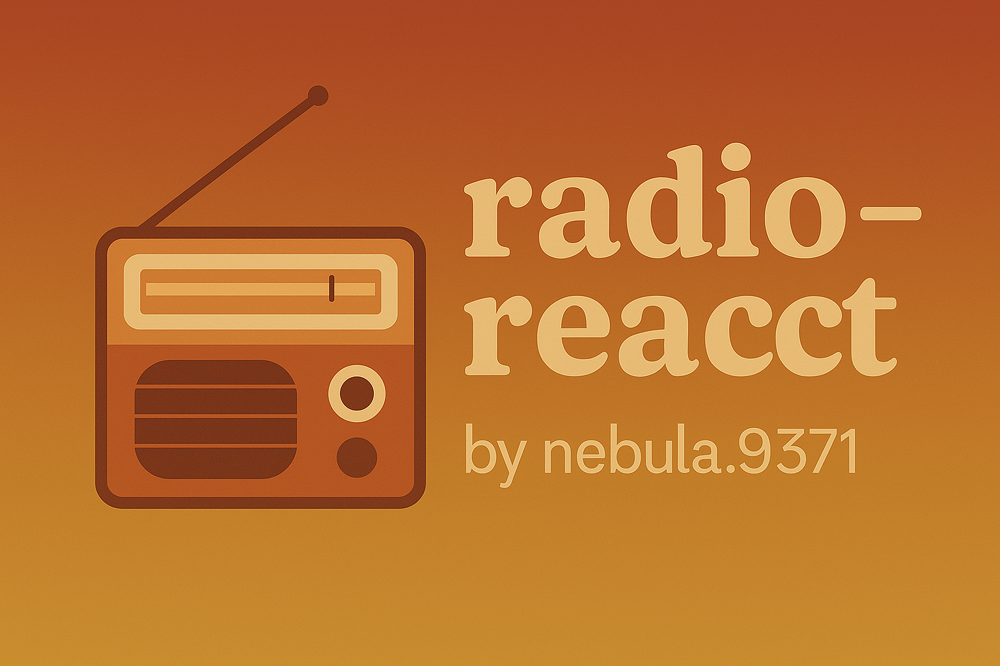

# 🎧 radio-react



---

[](https://github.com/wolk8506/radio-react/actions/workflows/deploy.yml)


[](https://github.com/wolk8506)


## 🚀 Tech Stack


## 📡 О проекте

**radio-react** — это React-приложение, вдохновлённое идеей онлайн-радио. Здесь планируется:

- 📻 Удобный аудиоплеер с избранными станциями
- 🌤️ Погода
- 💹 Курс валют
- 👨‍🍳 Рецепты
- 🎨 Кастомный UI с поддержкой тёмной темы
- 🌐 Стриминг из разных источников

## 🚀 Быстрый старт

```bash
git clone https://github.com/wolk8506/radio-react.git
cd radio-react
npm install
npm run dev
```
